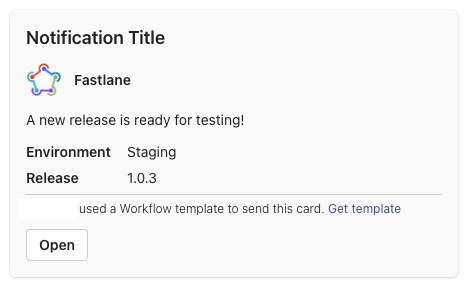
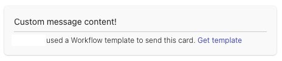

# Microsoft Teams `fastlane` plugin via Workflow

[](https://rubygems.org/gems/fastlane-plugin-teams_card)

> ⚠️ Note: This plugin utilizes the latest **Workflows** app (rather than the [now-retired Office connectors](https://devblogs.microsoft.com/microsoft365dev/retirement-of-office-365-connectors-within-microsoft-teams/) used in other plugins)

## Getting Started

This project is a [_fastlane_](https://github.com/fastlane/fastlane) plugin. To get started with `fastlane-plugin-teams_card`, add it to your project by running:

```bash
fastlane add_plugin teams_card
```

## About teams_card

With this plugin you will be able to send messages to a Microsoft Teams channel, group chat or chat. This plugin utilizes the latest **Workflows** app (rather than the [now-retired Office connectors](https://devblogs.microsoft.com/microsoft365dev/retirement-of-office-365-connectors-within-microsoft-teams/) used in other plugins).


`teams_card` allows you to send a fully custom message to a specific incoming webhook. You can use a predefined card with optional elements like a title, an image, or a button to open a URL. It's also possible to fully customize the card using JSON. It utilizes [Adaptive Cards](https://adaptivecards.io/samples/).

## Usage

To get started, first, [set up an incoming webhook workflow from a template](https://support.microsoft.com/en-us/office/create-incoming-webhooks-with-workflows-for-microsoft-teams-8ae491c7-0394-4861-ba59-055e33f75498) in Microsoft Teams.

```ruby
teams_card(
    workflow_url: 'https://your.logic.azure.com:443/workflows/1234567890',
    text: 'A new release is ready for testing!',
    image: 'https://raw.githubusercontent.com/fastlane/boarding/master/app/assets/images/fastlane.png',
    image_title: 'Fastlane',
    ]
  )
```

or

```ruby
teams_card(
    workflow_url: 'https://your.logic.azure.com:443/workflows/1234567890',
    title: 'Notification Title',
    text: 'A new release is ready for testing!',
    image: 'https://raw.githubusercontent.com/fastlane/boarding/master/app/assets/images/fastlane.png',
    image_title: 'Fastlane',
    open_url: 'https://beta.itunes.apple.com/v1/app/_YOUR_APP_ID_',
    facts: [
      {
        'title' => 'Environment',
        'value' => 'Staging'
      },
      {
        'title' => 'Release',
        'value' => '1.0.3'
      }
    ]
  )
```

This code produces the following message:



### Custom Adaptive cards

You can fully customize your cards by providing a custom JSON for AdaptiveCard. Look at the [templates and information on how to customize cards](https://adaptivecards.io/samples/). Note that MS Teams cannot display the latest versions of the schema!

```ruby
teams_card(
    workflow_url: "https://your.logic.azure.com:443/workflows/1234567890",
    custom_card: {
      "type" => "AdaptiveCard",
      "body" => [
        {
          "type" => "TextBlock",
          "text" => "Custom message content!",
          "wrap" => true
        }
      ],
      "$schema" => "http://adaptivecards.io/schemas/adaptive-card.json",
      "version" => "1.2"
    }
  )
```

This code produces the following message:



### Help

Once installed, information and help for an action can be printed out with this command:

```bash
fastlane action teams_card
```

### `teams_card`

| Key         | Description                                        | Env Var(s)                | Default |
|-------------|----------------------------------------------------|---------------------------|---------|
| `title`     | Optional title                                     | `TEAMS_MESSAGE_TITLE`     |         |
| `image`     | Optional image on your activity (project logo, company logo, etc.) | `TEAMS_MESSAGE_IMAGE` |         |
| `image_title` | Optional title next to your image               | `TEAMS_MESSAGE_IMAGE_TITLE` |       |
| `text`      | The message you want to display                     | `TEAMS_MESSAGE_TEXT`      |         |
| `facts`     | Optional facts (assigned to, due date, status, branch, environment, etc.) | `TEAMS_MESSAGE_FACTS` | `[]`    |
| `open_url`  | Optional URL for a button at the bottom of the card | `TEAMS_MESSAGE_OPEN_URL`  |         |
| `custom_card`  | Optional JSON to fully customize your card. | `TEAMS_MESSAGE_CUSTOM_CARD`  |         |
| `workflow_url` | The URL of the incoming Webhook you created in Workflows app | `TEAMS_MESSAGE_WORKFLOW_URL` | |


## Example

Check out the [example `Fastfile`](fastlane/Fastfile) to see how to use this plugin. Try it by cloning the repo, running `fastlane install_plugins` and `bundle exec fastlane test`.

## Run tests for this plugin

To run both the tests, and code style validation, run

```
rake
```

To automatically fix many of the styling issues, use
```
rubocop -a
```

## Issues and Feedback

For any other issues and feedback about this plugin, please submit it to this repository.

## Troubleshooting

If you have trouble using plugins, check out the [Plugins Troubleshooting](https://docs.fastlane.tools/plugins/plugins-troubleshooting/) guide.

## Using _fastlane_ Plugins

For more information about how the `fastlane` plugin system works, check out the [Plugins documentation](https://docs.fastlane.tools/plugins/create-plugin/).

## About _fastlane_

_fastlane_ is the easiest way to automate beta deployments and releases for your iOS and Android apps. To learn more, check out [fastlane.tools](https://fastlane.tools).
